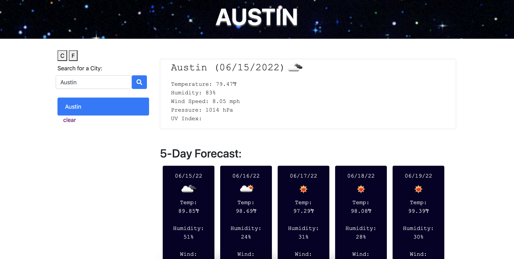

WeatherDashboard
 

Check current weather in cities around the world, see 5 day forecast.
 
This project uses the OpenWeather API, Bootstrap, Fontawesome, JQuery, and Moment.js.
 
Link to Deployed Application:
https://surfinsofia.github.io/WeatherDashboard/

To do:
 
Add UV Index by getting latitude and latitude
 
Button to change to Celsius
